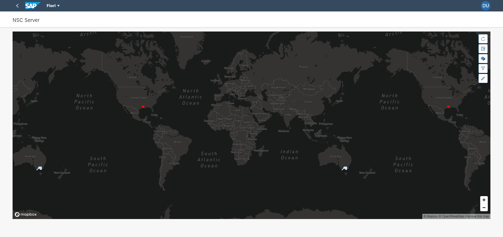

# nsc-ui5-host

An UI5 application to test the integration of NSC custom UI5 library.



## Pre-requisites:

1. Active NodeJS LTS (Long Term Support) version and associated supported NPM version.  (See https://nodejs.org)
2. IDE: SAP Business Application Studio or Visual Studio Code

## Getting Started

- Install > Run

```shell
# Install depencies
> npm install

# Run the app
> npm start
```

